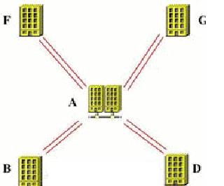
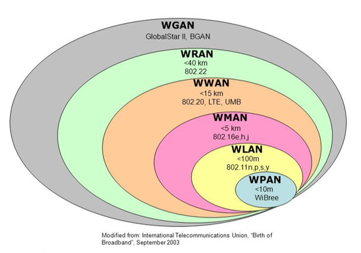
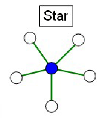
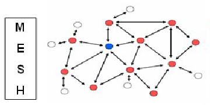
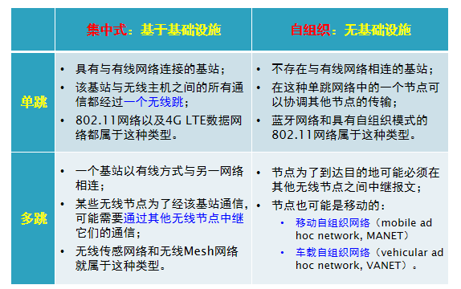
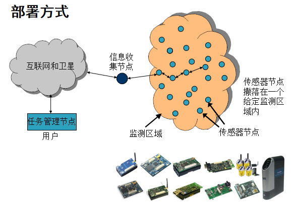
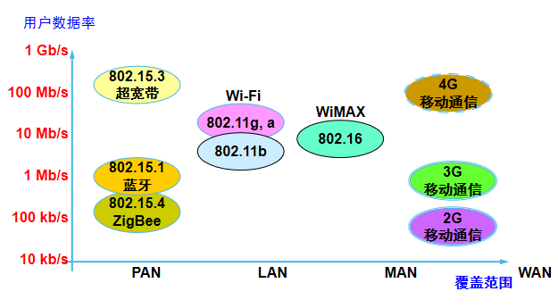

# 课程概述

# 课程主要内容

- [x] 无线通信和网络
  - 无线通信技术基础、无线局域网、移动通信网络、无线自组织网络、传感器网络、物联网...
- [x] 无线网络安全
  - 无线网络安全概述、无线局域网安全、移动通信网安全、其它无线网络安全
- [x] 相关领域最新进展

## 考核方式

- [x] 成绩：随堂作业或实验报告(30%)+考试(70%)

- [x] 考试形式：开卷

# 第一章 无线网络概述

## 基本概念

- [x] 无线通信(Wireless Communication)
  - `广义` ：没有“线”的通讯，甚至不需要物理传输媒介；
    > - 心灵感应、量子之间的纠缠态等；
  - `狭义` ：利用 `电磁波` 信号可以在自由空间中传播的特性进行信息交换的一种通信方式。

<!-- chat:start -->

<!-- title: 小Tips -->

#### **Tips**

其实无线通信比有线通信的历史更悠久

<!-- chat:end -->

- [x] 无线网络(Wireless Networks)
  - 采用无线通讯技术组建的网络，包括：
    > - 允许用户建立远距离无线连接的 `全球语音和数据网络` ；
    > - 为近距离无线连接进行优化的 `红外线技术及射频技术` 。

<!-- chat:start -->

<!-- title: 小Tips -->

#### **Tips**

与有线网络的用途十分类似，最大的不同在于传输媒介的不同，利用无线电技术取代网线

<!-- chat:end -->

## 无线网络简介

- [x] 利用 `无线电波` 作为信息传输的媒介的通信网络，摆脱了网线的束缚，在应用层面，与有线网络的 `用途相似` ；

- [x] 无线网络的优势
  - 无线网络在硬件架设、安装成本和应用机动性方面更有优势；
    > - 主要用4G/5G、WiFi、蓝牙等无线通信技术实现无线网络；
  - 让人们 **摆脱有线的束缚，更便捷、更自由地沟通** 。

- [x] 无线网络和有线网络的根本不同：通信媒介不同，带来很多难点问题
  - 可靠性、移动性、拓扑管理、资源管理、安全性...    

### 为什么要用无线网络？

- [x] 摆脱物理束缚、实现无处不在的/移动过程中的访问
- [x] 快速部署、动态配置
- [x] 不需要土地许可证
- [x] 建筑物中、太空、水下...
- [x] 人体内、设备内、芯片内...

- 构造 **随时可用的网络环境** ，实现 `6A`
  > - 任何人(Anyone)
  > - 在任何时候(Anytime)
  > - 任何地点(Anywhere)
  > - 可以采用任何方式(Any means)
  > - 与其他任何人(Any other)
  > - 进行任何通信(Anything)

### 无线网络成功的关键

- 成熟的无线网络技术
- 全覆盖的无线网络基础设施
- 无线终端的普及
- 频谱资源的保证
- 杀手级应用+完善的产业链

### 无线网络的诞生

- [x] 1971年，夏威夷大学的研究人员从第二次世界大战美军利用无线电信号结合高性能加密技术实现了文件资料的传输得到灵感创造了 **第一个** $\color{red}{基于封包式技术的无线电通讯网络--ALOHANet}$ ，可以算是早期的无线局域网络(WLAN)
  > - ALOHANet包括7台计算机，采用双向星型拓扑(bi-directional star topology)横跨四座夏威夷的岛屿，中心计算机放置在瓦胡岛(Oahu Island)上；
  > - 标志着无线网络的诞生。

  
  

   双向星型拓扑
  

<!-- chat:start -->

<!-- title: 小Tips -->

#### **Tips**

ALOHANet使用新的介质访问技术，称为ALOHA随机存取(ALOHA random access)，后来发展为以太网通信协议802.3

<!-- chat:end -->

### 无线网络的发展

- [x] 1990年，电气电子工程师学会IEEE正式启用了802.11项目
  - IEEE802.11标准诞生后，出现了802.11a(1999)、802.11b(1999)，802.11g(2003)、802.11n(2009)...无线网络时代来临。

- [x] 无线热点(hot-spot)：网络运营商提供的WiFi接入，机场、饭店、会议设施、咖啡厅、火车站、校园。

#### Wi-Fi ≠ IEEE 802.11

- [x] 1999年无线以太兼容性联盟(WECA)成立，后更名无线联盟(Wi-Fi)，建立了用于验证802.11b产品互操作能力的一套测试程序；
- [x] 2004年起，验证的802.11b产品使用名称是Wi-Fi；
- [x] Wi-Fi认证已扩展到802.11g、802.11n...；
- [x] 在无线局域网标准的采纳和市场化推进中起到了主导作用

### 无线网络的标准

- [x] 当前商业无线网络环境下，主要的无线网络标准分为两类：
  - **无线计算机网络标准**
    > - 计算机网络发展而来
    > - 支持计算机通信、互联网接入
  - **蜂窝网(移动通信网络)标准**
    > - 蜂窝电话发展而来

- [x] 两种标准的差异
  - **对于移动性的支持程度**
    > - 无线计算机网络最初不支持移动性
    > - 蜂窝网设计之初就支持高移动性
  - **对资源的分配方式**

<!-- chat:start -->

<!-- title: 小Tips -->

#### **Tips**

随着技术和商业需求的发展，两种技术互相取长补短、界限越来越模糊，两类系统最终将会相互融合

<!-- chat:end -->

### 无线网络分类

#### 按照覆盖范围分类

- 系统内部互连/无线个域网
- 无线局域网
- 无线城域网/广域网

  

##### 系统内部互联/无线个域网

- [x] 系统内部互连是指通过短距离的无线电，将一台计算机的各个部件连接起来；
  - `蓝牙(Blue Tooth)` 是一种典型短距离无线网络，将这些部件以无线的方式连接起来，多采用 `主从模式` ；
  - `红外` 无线传输技术、 `家庭射频` 和目前最新的 `Zigbee` 、 `超宽带无线技术UWB` 也都可以用于无线系统内部互连，构建无线个域网、无线体域网等。 

##### 无线局域网

- [x] 第一类是 `有固定基础设施` ：802.11 WLAN
- [x] 第二类是 `无固定基础设施` ：自组织网络(Ad hoc网络)
  - 无固定的 `路由器` ，网络中节点可随意移动并能以任意方式相互通信；
  - 每个节点都能实现路由器的功能而在网络中搜寻、维护到另一节点的路由；
  - 自组织网可用在事故的突发现场以及人们希望能迅速共享信息的会议、办公室等场所。

##### 无线城域/广域网络

- 蜂窝通信(蜂窝通信)
  - 1G：模拟信号，只能传送语音，如大哥大
  - 2G：数字信号，只能传送语音，如语音手机
    > - 2.5、2.75G：数字信号，可以传送语音和数据，如GPRS、EDGE；
  - 3G：数字信号，语音和数据(开始可以互联网接入)
    > - 2000年：CDMA2000\WCDMA\TD-SCDMA；2007年：WiMAX
    > - 3G+/E3G：HSDPA、HSUPA；LTE、UMB
  - 4G：LTE-A、802.16m(可以视频)
  - 5G/6G(超高清视频，智能家居)...

#### 按拓扑结构分类

- [x] 集中式

  

- 基站(基础设施，Infrastructure)
  - 集中式网络拓扑中的中央设备；
  - 负责向与之关联的无线主机发送数据和从主机那里接收数据；
  - 负责协调与之相关联的多个无线主机的传输；
    > - 当一台无线主机与某基站“相关联”时，表示该主机位于该基站的无线通信范围内，该主机使用该基站中继它和更大网络之间的数据；
  - 蜂窝网络中的蜂窝塔(Mobile Base Station或Cell Towers)和802.11无线LAN中的接入点(Access Point, AP)都属于基站。

- [x] 扁平式(分布式、自组织)

  

<!-- chat:start -->

<!-- title: 小Tips -->

#### **Tips**

注意：一般在无线网络中说到的“跳(Hop)”都指无线的“跳”

<!-- chat:end -->

  
  

   两者之间的区别
  

#### 从无线网络的应用角度分类

- 无线传感器网络
- 无线Mesh网络
- 无线穿戴网络
- 无线体域网
- DTN网络
- 认知无线网络

<!-- chat:start -->

<!-- title: 小Tips -->

#### **Tips**

这些网络一般是基于已有的无线网络技术，针对具体的应用而构建的无线网络。

<!-- chat:end -->

##### 无线传感器网络

- [x] 无线传感网络(WSN，Wireless Sensor Networks)
  - 综合了传感器技术、嵌入式计算技术、现代网络及无线通信技术、分布式信息处理技术；
  - 能够通过各类集成化的微型传感器协作地实时 `监测、感知和采集` 各种环境或监测对象的信息，这些信息通过无线方式被发送，并以自组多跳的网络方式传送到用户终端；
  - 实现物理世界、计算世界以及人类社会 `三元世界的连通` 。

  
  

   部署方式
  

<!-- chat:start -->

<!-- title: 小Tips -->

#### **Tips**

无线传感器网络在军事应用进行侦查监督评估和环境检测(火险，洪水，精确农耕，大气等)等方面具有应用

<!-- chat:end -->

##### 无线Mesh网络

- [x] 无线Mesh网络是一种与传统无线网络完全不同的新型无线网络，由移动Ad Hoc网络人们无处不在的Internet接入需求演变而来，被形象称为无线版本的Internet。
  > - 基站设备大幅减少，为无线网络服务商减少70%多的营运、安装成本，扩大网络仅需要将设备接上电源。

- [x] 其实可以理解为由无线网络设备(WMN Router)和信道构建的骨干网架构，其它设备通过边缘路由器接入该网络；

- [x] 一般假设WMN Router是固定的，具有较高的性能(计算、存储、电量等)

- [x] 无线Mesh网络中，任何无线设备节点都可以 `同时作为AP和路由器` ，网络中的每个节点都可以发送和接收信号，每个节点都可以与一个或者多个对等节点进行直接通信；

- [x] 若最近的AP流量过大导致 `拥塞` ，数据可自动重新路由到一个通信流量较小的邻近节点进行传输；

- [x] 数据包还可以根据网络的情况，继续路由到与之最近的下一个节点进行传输，直到到达最终目的地。

<!-- tabs:start -->

#### **优点**

- 可靠性高（无单点故障）
- 组网灵活、维护方便
- 投资成本低

#### **缺点**

- 路由、资源分配算法设计困难
- 性能差(跳数越多，性能越差)
- 安全性
- 一般用2.4GHz频段，易受干扰

<!-- tabs:end -->

##### 无线穿戴网络

- [x] 无线穿戴网络是基于短距离无线通信技术(蓝牙和ZigBee技术等)与可穿戴式计算机(wearcomp)技术、穿戴在人体上、具有智能收集人体和周围环境信息的一种新型个域网(PAN)
  - **人体传感器网络**
    > - 脉搏、心跳监控等传送至手持设备
  - **可穿戴的媒体播放**
    > - 音乐媒体传送至无线耳机
  - **通信终端应用**
    > - 个人实时数据传送至网络
  - **视频流应用**
    > - 采访摄像、药片照相机
  - **远程医疗**
    - 远程监控人体的生理数据(心脏速率、血压)
      > - 采集的数据通过网络送到负责病人的主管医生
      > - 病人获得极大的行动自由度
    - 跟踪和监督医院内的病人和医生
    - 医院的药物管理
    - 正确地识别病人的敏感反应避免误诊
    - 老人家庭环境下的护理(tele-care)
      > - 随着社会老龄化的加剧而日趋重要

##### 延迟/中断容忍网络

- [x] Delay/Disruption-Tolerant Networking(DTN)
  - 基于TCP/IP协议的互联网服务模型基于以下假设：
    > - 在通信持续时间里，源和目的之间存在端到端路径
    > - 任何一对节点之间的最大往返时间不会太长
    > - 丢包率较小
  - **实际中存在一类不满足以上假设的网络**
    - `陆地移动网络` ：链路经常性中断
    - `采用非寻常媒体的网络` ：延迟可能很长
    - `传感器网络` ：节点资源受限，通信需要按计划调度

- [x] DTN的特点：
  - 长延时(分钟级及以上)
  - 节点资源有限
  - 间歇性连接
  - 不对称数据速率
  - 低信噪比(高误码率)

##### 认知无线网络(Cognitive Wireless Networks)

###### 无线网络所面临的问题-频谱问题

> - 联邦通信委员会(FCC)统计当前无线带宽利用率只有5~10%!!!
> - 频谱资源的短缺，频谱短缺与浪费之间的矛盾

- [x] 网络通过观察、学习和优化自己的行为，提高端到端的效能
  - 通过对无线通信网络环境的 `交互感知` 作用，进行智能规划、决策和调度、自组织的实现组网并自适应于具体无线通信环境，有效地优化网络资源的管理和使用状况；
  - 要求认知无线网络不仅能够感知当前的状况以采取相应的自适应行动，并且具备 <kbd>记忆、思考和学习</kbd> 的能力。

> 认知无线网络技术不仅可以 $\color{blue}{提高网络资源利用效率}$ 、提供无线电通信 $\color{blue}{兼容性}$ 和 $\color{blue}{自适应于无线网络资源的动态变化}$ ，更能 $\color{red}{适应复杂电磁环境下通信资源和通信手段的限制与反限制、攻击与保护}$ 等。

###### 无线网络所面临的问题-异构性问题

- 认知无线电实施的条件 
  - 不应当影响预约用户的服务质量、信号质量等；
  - 认知无线网络可以达到多种网络的大融合（研究中）。

- 国外研究计划
  - 2003年，美国国防部高级研究计划署(DARPA)提供1700万美元启动了下一代无线通信计划(XG)，重点解决频谱资源的动态使用；
  - 欧盟FP6、FP7项目：2008年启动5个有关频谱资源和异构网融合的项目，投入超过5000万欧元；主要面向工程实现和标准化。

- 标准化
  - IEEE、国际电信联盟ITU等对认知无线电系统的标准化非常积极，分别成立了专门的工作组；
  - 2011年的世界无线电大会大会将认知无线电系统作为重点议程。

### 无线信号传输方向

- 广播方式
  - Wifi
  - 蓝牙
  - ...

- 定向/定范围
  - 激光
  - 红外

### 几种无线网络的比较

  
  

   几种无线网络的比较
  

### 综合应用场景

- 物联网
- 家庭网络
- 车联网
- 卫星网络
- 军事网络
- 工业互联网

#### 物联网

- [x] 国际电信联盟(ITU)的定义
  - 物到物(Thing to Thing，T2T)
  - 人到物(Human to Thing，H2T)
  - 人到人(Human to Human，H2H)

<!-- chat:start -->

<!-- title: 小Tips -->

#### **Tips**

物联网是连接物品的网络，有些学者在讨论物联网时，常提到M2M的概念，就是Machine to Machine

<!-- chat:end -->

#### 家庭网络

- [x] 在各种应用彼此孤立的情况下，数字家庭就好比是一个杂乱的大熔炉，其中包含了能够执行各种毫不相关功能的电子设备和应用，没有关联性；
- [x] 构建家庭网络，计算、通信、娱乐以及家庭自动化系统等就能立即 `协同工作` ，根据需要 `共享信息和资源` ，进而作为高效统一的整体发挥作用。

#### 车联网

- [x] 车联网(V2X)概念
  - 车辆通过多种通信技术，实现车与车(V2V)、车与人(V2P)、车与路(V2I)、车与网络(V2N)的全方位连接；
  - 支持智能驾驶中环境感知、智能决策、协同控制等。

- [x] 三大领域
  - 聪明的车、智慧的路、车路协同

- [x] 三大服务
  - 信息服务类应用(以用户体验为核心)
  - 安全效率类应用(以车辆驾驶为核心)
  - 智慧交通类应用(以协同为核心)

> - C-V2X是车联网的3GPP标准通信技术
> - 自动驾驶是车联网的应用场景之一
> - 车路协同是自动驾驶落地的必由之路

#### 工业互联网

- [x] 工业互联网(Industrial Internet of Things，IIoT)
  - 新一代信息通信技术与工业深度融合的新型基础设施和应用模式；
  - 通过对人、机、物的全面连接构建覆盖全产业链、全价值链的全新制造和服务体系，为工业制造的数字化、网络化、智能化发展提供实现途径，是第四次工业革命的重要基石；

- [x] 四大特征：
  - 泛在连接、云化服务、知识积累、应用创新

- [x] 主流方向：
  - 云原生架构、泛在部署、容器化和微服务化
