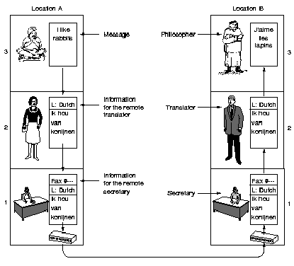
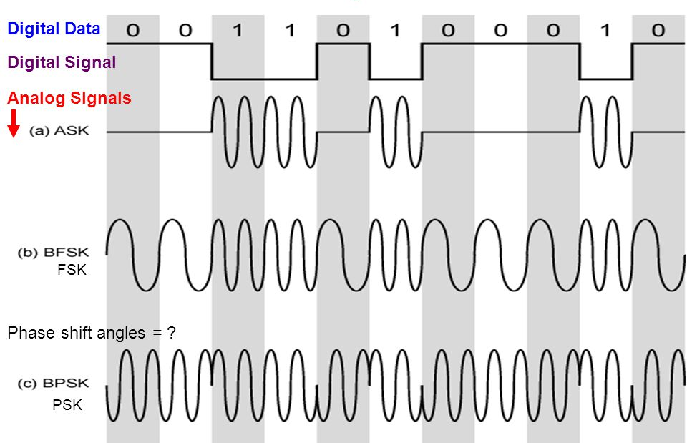
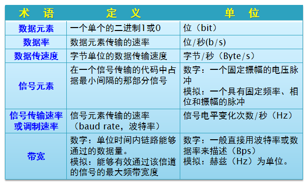

# 课程概述

# 课程主要内容

- [x] 无线通信和网络
  - 无线通信技术基础、无线局域网、移动通信网络、无线自组织网络、传感器网络、物联网...
- [x] 无线网络安全
  - 无线网络安全概述、无线局域网安全、移动通信网安全、其它无线网络安全
- [x] 相关领域最新进展

## 考核方式

- [x] 成绩：随堂作业或实验报告(30%)+考试(70%)

- [x] 考试形式：开卷

# 第一章 无线网络概述

## 基本概念

- [x] 无线通信(Wireless Communication)
  - `广义` ：没有“线”的通讯，甚至不需要物理传输媒介；
    > - 心灵感应、量子之间的纠缠态等；
  - `狭义` ：利用 `电磁波` 信号可以在自由空间中传播的特性进行信息交换的一种通信方式。

<!-- chat:start -->

<!-- title: 小Tips -->

#### **Tips**

其实无线通信比有线通信的历史更悠久

<!-- chat:end -->

- [x] 无线网络(Wireless Networks)
  - 采用无线通讯技术组建的网络，包括：
    > - 允许用户建立远距离无线连接的 `全球语音和数据网络` ；
    > - 为近距离无线连接进行优化的 `红外线技术及射频技术` 。

<!-- chat:start -->

<!-- title: 小Tips -->

#### **Tips**

与有线网络的用途十分类似，最大的不同在于传输媒介的不同，利用无线电技术取代网线

<!-- chat:end -->

## 无线网络简介

- [x] 利用 `无线电波` 作为信息传输的媒介的通信网络，摆脱了网线的束缚，在应用层面，与有线网络的 `用途相似` ；

- [x] 无线网络的优势
  - 无线网络在硬件架设、安装成本和应用机动性方面更有优势；
    > - 主要用4G/5G、WiFi、蓝牙等无线通信技术实现无线网络；
  - 让人们 **摆脱有线的束缚，更便捷、更自由地沟通** 。

- [x] 无线网络和有线网络的根本不同：通信媒介不同，带来很多难点问题
  - 可靠性、移动性、拓扑管理、资源管理、安全性...    

### 为什么要用无线网络？

- [x] 摆脱物理束缚、实现无处不在的/移动过程中的访问
- [x] 快速部署、动态配置
- [x] 不需要土地许可证
- [x] 建筑物中、太空、水下...
- [x] 人体内、设备内、芯片内...

- 构造 **随时可用的网络环境** ，实现 `6A`
  > - 任何人(Anyone)
  > - 在任何时候(Anytime)
  > - 任何地点(Anywhere)
  > - 可以采用任何方式(Any means)
  > - 与其他任何人(Any other)
  > - 进行任何通信(Anything)

### 无线网络成功的关键

- 成熟的无线网络技术
- 全覆盖的无线网络基础设施
- 无线终端的普及
- 频谱资源的保证
- 杀手级应用+完善的产业链

### 无线网络的诞生

- [x] 1971年，夏威夷大学的研究人员从第二次世界大战美军利用无线电信号结合高性能加密技术实现了文件资料的传输得到灵感创造了 **第一个** $\color{red}{基于封包式技术的无线电通讯网络--ALOHANet}$ ，可以算是早期的无线局域网络(WLAN)
  > - ALOHANet包括7台计算机，采用双向星型拓扑(bi-directional star topology)横跨四座夏威夷的岛屿，中心计算机放置在瓦胡岛(Oahu Island)上；
  > - 标志着无线网络的诞生。

  
  

   双向星型拓扑
  

<!-- chat:start -->

<!-- title: 小Tips -->

#### **Tips**

ALOHANet使用新的介质访问技术，称为ALOHA随机存取(ALOHA random access)，后来发展为以太网通信协议802.3

<!-- chat:end -->

### 无线网络的发展

- [x] 1990年，电气电子工程师学会IEEE正式启用了802.11项目
  - IEEE802.11标准诞生后，出现了802.11a(1999)、802.11b(1999)，802.11g(2003)、802.11n(2009)...无线网络时代来临。

- [x] 无线热点(hot-spot)：网络运营商提供的WiFi接入，机场、饭店、会议设施、咖啡厅、火车站、校园。

#### Wi-Fi ≠ IEEE 802.11

- [x] 1999年无线以太兼容性联盟(WECA)成立，后更名无线联盟(Wi-Fi)，建立了用于验证802.11b产品互操作能力的一套测试程序；
- [x] 2004年起，验证的802.11b产品使用名称是Wi-Fi；
- [x] Wi-Fi认证已扩展到802.11g、802.11n...；
- [x] 在无线局域网标准的采纳和市场化推进中起到了主导作用

### 无线网络的标准

- [x] 当前商业无线网络环境下，主要的无线网络标准分为两类：
  - **无线计算机网络标准**
    > - 计算机网络发展而来
    > - 支持计算机通信、互联网接入
  - **蜂窝网(移动通信网络)标准**
    > - 蜂窝电话发展而来

- [x] 两种标准的差异
  - **对于移动性的支持程度**
    > - 无线计算机网络最初不支持移动性
    > - 蜂窝网设计之初就支持高移动性
  - **对资源的分配方式**

<!-- chat:start -->

<!-- title: 小Tips -->

#### **Tips**

随着技术和商业需求的发展，两种技术互相取长补短、界限越来越模糊，两类系统最终将会相互融合

<!-- chat:end -->

### 无线网络分类

#### 按照覆盖范围分类

- 系统内部互连/无线个域网
- 无线局域网
- 无线城域网/广域网

  

##### 系统内部互联/无线个域网

- [x] 系统内部互连是指通过短距离的无线电，将一台计算机的各个部件连接起来；
  - `蓝牙(Blue Tooth)` 是一种典型短距离无线网络，将这些部件以无线的方式连接起来，多采用 `主从模式` ；
  - `红外` 无线传输技术、 `家庭射频` 和目前最新的 `Zigbee` 、 `超宽带无线技术UWB` 也都可以用于无线系统内部互连，构建无线个域网、无线体域网等。 

##### 无线局域网

- [x] 第一类是 `有固定基础设施` ：802.11 WLAN
- [x] 第二类是 `无固定基础设施` ：自组织网络(Ad hoc网络)
  - 无固定的 `路由器` ，网络中节点可随意移动并能以任意方式相互通信；
  - 每个节点都能实现路由器的功能而在网络中搜寻、维护到另一节点的路由；
  - 自组织网可用在事故的突发现场以及人们希望能迅速共享信息的会议、办公室等场所。

##### 无线城域/广域网络

- 蜂窝通信(蜂窝通信)
  - 1G：模拟信号，只能传送语音，如大哥大
  - 2G：数字信号，只能传送语音，如语音手机
    > - 2.5、2.75G：数字信号，可以传送语音和数据，如GPRS、EDGE；
  - 3G：数字信号，语音和数据(开始可以互联网接入)
    > - 2000年：CDMA2000\WCDMA\TD-SCDMA；2007年：WiMAX
    > - 3G+/E3G：HSDPA、HSUPA；LTE、UMB
  - 4G：LTE-A、802.16m(可以视频)
  - 5G/6G(超高清视频，智能家居)...

#### 按拓扑结构分类

- [x] 集中式

  

- 基站(基础设施，Infrastructure)
  - 集中式网络拓扑中的中央设备；
  - 负责向与之关联的无线主机发送数据和从主机那里接收数据；
  - 负责协调与之相关联的多个无线主机的传输；
    > - 当一台无线主机与某基站“相关联”时，表示该主机位于该基站的无线通信范围内，该主机使用该基站中继它和更大网络之间的数据；
  - 蜂窝网络中的蜂窝塔(Mobile Base Station或Cell Towers)和802.11无线LAN中的接入点(Access Point, AP)都属于基站。

- [x] 扁平式(分布式、自组织)

  

<!-- chat:start -->

<!-- title: 小Tips -->

#### **Tips**

注意：一般在无线网络中说到的“跳(Hop)”都指无线的“跳”

<!-- chat:end -->

  
  

   两者之间的区别
  

#### 从无线网络的应用角度分类

- 无线传感器网络
- 无线Mesh网络
- 无线穿戴网络
- 无线体域网
- DTN网络
- 认知无线网络

<!-- chat:start -->

<!-- title: 小Tips -->

#### **Tips**

这些网络一般是基于已有的无线网络技术，针对具体的应用而构建的无线网络。

<!-- chat:end -->

##### 无线传感器网络

- [x] 无线传感网络(WSN，Wireless Sensor Networks)
  - 综合了传感器技术、嵌入式计算技术、现代网络及无线通信技术、分布式信息处理技术；
  - 能够通过各类集成化的微型传感器协作地实时 `监测、感知和采集` 各种环境或监测对象的信息，这些信息通过无线方式被发送，并以自组多跳的网络方式传送到用户终端；
  - 实现物理世界、计算世界以及人类社会 `三元世界的连通` 。

  
  

   部署方式
  

<!-- chat:start -->

<!-- title: 小Tips -->

#### **Tips**

无线传感器网络在军事应用进行侦查监督评估和环境检测(火险，洪水，精确农耕，大气等)等方面具有应用

<!-- chat:end -->

##### 无线Mesh网络

- [x] 无线Mesh网络是一种与传统无线网络完全不同的新型无线网络，由移动Ad Hoc网络人们无处不在的Internet接入需求演变而来，被形象称为无线版本的Internet。
  > - 基站设备大幅减少，为无线网络服务商减少70%多的营运、安装成本，扩大网络仅需要将设备接上电源。

- [x] 其实可以理解为由无线网络设备(WMN Router)和信道构建的骨干网架构，其它设备通过边缘路由器接入该网络；

- [x] 一般假设WMN Router是固定的，具有较高的性能(计算、存储、电量等)

- [x] 无线Mesh网络中，任何无线设备节点都可以 `同时作为AP和路由器` ，网络中的每个节点都可以发送和接收信号，每个节点都可以与一个或者多个对等节点进行直接通信；

- [x] 若最近的AP流量过大导致 `拥塞` ，数据可自动重新路由到一个通信流量较小的邻近节点进行传输；

- [x] 数据包还可以根据网络的情况，继续路由到与之最近的下一个节点进行传输，直到到达最终目的地。

<!-- tabs:start -->

#### **优点**

- 可靠性高（无单点故障）
- 组网灵活、维护方便
- 投资成本低

#### **缺点**

- 路由、资源分配算法设计困难
- 性能差(跳数越多，性能越差)
- 安全性
- 一般用2.4GHz频段，易受干扰

<!-- tabs:end -->

##### 无线穿戴网络

- [x] 无线穿戴网络是基于短距离无线通信技术(蓝牙和ZigBee技术等)与可穿戴式计算机(wearcomp)技术、穿戴在人体上、具有智能收集人体和周围环境信息的一种新型个域网(PAN)
  - **人体传感器网络**
    > - 脉搏、心跳监控等传送至手持设备
  - **可穿戴的媒体播放**
    > - 音乐媒体传送至无线耳机
  - **通信终端应用**
    > - 个人实时数据传送至网络
  - **视频流应用**
    > - 采访摄像、药片照相机
  - **远程医疗**
    - 远程监控人体的生理数据(心脏速率、血压)
      > - 采集的数据通过网络送到负责病人的主管医生
      > - 病人获得极大的行动自由度
    - 跟踪和监督医院内的病人和医生
    - 医院的药物管理
    - 正确地识别病人的敏感反应避免误诊
    - 老人家庭环境下的护理(tele-care)
      > - 随着社会老龄化的加剧而日趋重要

##### 延迟/中断容忍网络

- [x] Delay/Disruption-Tolerant Networking(DTN)
  - 基于TCP/IP协议的互联网服务模型基于以下假设：
    > - 在通信持续时间里，源和目的之间存在端到端路径
    > - 任何一对节点之间的最大往返时间不会太长
    > - 丢包率较小
  - **实际中存在一类不满足以上假设的网络**
    - `陆地移动网络` ：链路经常性中断
    - `采用非寻常媒体的网络` ：延迟可能很长
    - `传感器网络` ：节点资源受限，通信需要按计划调度

- [x] DTN的特点：
  - 长延时(分钟级及以上)
  - 节点资源有限
  - 间歇性连接
  - 不对称数据速率
  - 低信噪比(高误码率)

##### 认知无线网络(Cognitive Wireless Networks)

###### 无线网络所面临的问题-频谱问题

> - 联邦通信委员会(FCC)统计当前无线带宽利用率只有5~10%!!!
> - 频谱资源的短缺，频谱短缺与浪费之间的矛盾

- [x] 网络通过观察、学习和优化自己的行为，提高端到端的效能
  - 通过对无线通信网络环境的 `交互感知` 作用，进行智能规划、决策和调度、自组织的实现组网并自适应于具体无线通信环境，有效地优化网络资源的管理和使用状况；
  - 要求认知无线网络不仅能够感知当前的状况以采取相应的自适应行动，并且具备 <kbd>记忆、思考和学习</kbd> 的能力。

> 认知无线网络技术不仅可以 $\color{blue}{提高网络资源利用效率}$ 、提供无线电通信 $\color{blue}{兼容性}$ 和 $\color{blue}{自适应于无线网络资源的动态变化}$ ，更能 $\color{red}{适应复杂电磁环境下通信资源和通信手段的限制与反限制、攻击与保护}$ 等。

###### 无线网络所面临的问题-异构性问题

- 认知无线电实施的条件 
  - 不应当影响预约用户的服务质量、信号质量等；
  - 认知无线网络可以达到多种网络的大融合（研究中）。

- 国外研究计划
  - 2003年，美国国防部高级研究计划署(DARPA)提供1700万美元启动了下一代无线通信计划(XG)，重点解决频谱资源的动态使用；
  - 欧盟FP6、FP7项目：2008年启动5个有关频谱资源和异构网融合的项目，投入超过5000万欧元；主要面向工程实现和标准化。

- 标准化
  - IEEE、国际电信联盟ITU等对认知无线电系统的标准化非常积极，分别成立了专门的工作组；
  - 2011年的世界无线电大会大会将认知无线电系统作为重点议程。

### 无线信号传输方向

- 广播方式
  - Wifi
  - 蓝牙
  - ...

- 定向/定范围
  - 激光
  - 红外

### 几种无线网络的比较

  
  

   几种无线网络的比较
  

### 综合应用场景

- 物联网
- 家庭网络
- 车联网
- 卫星网络
- 军事网络
- 工业互联网

#### 物联网

- [x] 国际电信联盟(ITU)的定义
  - 物到物(Thing to Thing，T2T)
  - 人到物(Human to Thing，H2T)
  - 人到人(Human to Human，H2H)

<!-- chat:start -->

<!-- title: 小Tips -->

#### **Tips**

物联网是连接物品的网络，有些学者在讨论物联网时，常提到M2M的概念，就是Machine to Machine

<!-- chat:end -->

#### 家庭网络

- [x] 在各种应用彼此孤立的情况下，数字家庭就好比是一个杂乱的大熔炉，其中包含了能够执行各种毫不相关功能的电子设备和应用，没有关联性；
- [x] 构建家庭网络，计算、通信、娱乐以及家庭自动化系统等就能立即 `协同工作` ，根据需要 `共享信息和资源` ，进而作为高效统一的整体发挥作用。

#### 车联网

- [x] 车联网(V2X)概念
  - 车辆通过多种通信技术，实现车与车(V2V)、车与人(V2P)、车与路(V2I)、车与网络(V2N)的全方位连接；
  - 支持智能驾驶中环境感知、智能决策、协同控制等。

- [x] 三大领域
  - 聪明的车、智慧的路、车路协同

- [x] 三大服务
  - 信息服务类应用(以用户体验为核心)
  - 安全效率类应用(以车辆驾驶为核心)
  - 智慧交通类应用(以协同为核心)

> - C-V2X是车联网的3GPP标准通信技术
> - 自动驾驶是车联网的应用场景之一
> - 车路协同是自动驾驶落地的必由之路

#### 工业互联网

- [x] 工业互联网(Industrial Internet of Things，IIoT)
  - 新一代信息通信技术与工业深度融合的新型基础设施和应用模式；
  - 通过对人、机、物的全面连接构建覆盖全产业链、全价值链的全新制造和服务体系，为工业制造的数字化、网络化、智能化发展提供实现途径，是第四次工业革命的重要基石；

- [x] 四大特征：
  - 泛在连接、云化服务、知识积累、应用创新

- [x] 主流方向：
  - 云原生架构、泛在部署、容器化和微服务化

## 网络设计方法

- [x] 设计方法学 
  - 自顶向下
    > - 设计任务分解到不同的子任务
  - 自底向上
    > - 整理所有子任务组装成一个 

  

- [x] 分层架构 
  - 邮政系统
  - 电话系统
  - 行政规划
  - 计算机网络 

  

### OSI参考模型

- [x] 开放系统互连(OSI)，一个理论框架来开发协议标准
- [x] 由国际标准化组织建立(ISO)

  
  

<!-- chat:start -->

<!-- title: 小Tips -->

#### **Tips**

标准推行太慢以致于不能被用于实践! 被TCP/IP代替！ 

<!-- chat:end -->

### TCP/IP协议簇

- [x] 美国DARPA为ARPANET建立，成为事实上的标准； 
- [x] 由Vint Cerf和Robert Kahn定义(1974)；
- [x] 第一次在Internet中传输：从UCLA到SRI(Stanford Research Institute)。

  

#### 五层模型的TCP/IP

- [x] 连接层负责建立电路连接，是整个网络的物理基础，典型的协议包括以太网、ADSL等等；
- [x] 网络层负责分配地址和传送二进制数据，主要协议是IP协议；
- [x] 传输层负责传送文本数据，主要协议是TCP协议；
- [x] 应用层负责传送各种最终形态的数据，是直接与用户打交道的层，典型协议是HTTP、FTP等。

  

#### OSI与TCP/IP

  

#### 模块化设计理念和对等原则

- [x] 通信任务分割成一些模块, 每个模块有一个协议；
- [x] 每一层执行的一个所需的通信功能子集；
- [x] 每一层都是依赖于下一层来执行更原始的功能；
- [x] 每一层为更高一层提供服务；
- [x] 每一层的变化不应该需要其他层改变。

<!-- chat:start -->

<!-- title: 小Tips -->

#### **Tips**

对等原则：为了使数据分组从源传送到目的地，源端OSI模型的每一层都必须与目的端的对等层进行通信。

<!-- chat:end -->

  

- [x] 分层设计的优缺点

<!-- tabs:start -->

#### **优点**

设计简单、统一标准、便于查找故障

#### **缺点**

不能达到最优：尤其对无线网络来说
   MAC层和网络层耦合严重，互相影响

  

<!-- tabs:end -->

## 无线网络的研究重点

  

## 与网络相关的标准化组织

- [x] 众多的网络生产厂商各有其思路，若无法协调，不同的计算机系统则不能通信。
- [x] 电信领域中最有影响的组织：ITU(国际电信联盟)
  - International Telecommunications Union；
  - 多个欧洲国家于1865年成立的制定国际电信标准的专门机构，1947年ITU成为了联合国的代理机构，成员几乎扩展到每一个成员国；
  - ITU-T的任务是对电话、电报和数据通信接口提出一些技术性建议，政府可按需采纳或拒绝。
  - 三个主要部门：
    > - 无线电通信 `ITU-R(无线电频率分配)`
    > - 标准化 `ITU-T(标准建议)`
    > - 电信发展 `ITU-D(普及电信技术)`

- [x] 国际标准领域中最有影响的组织
  - ISO(International Organization for Standardization)
    - “国际化标准组织”，成立于1947年2月23日，由89个成员国的国家标准组织组成；
    - 负责为大量学科领域制定标准，从螺丝螺纹到电话的的外形，目前已发布了13000多个标准；
      > - 当某国或领域需要一个国际标准时，ISO启动标准制定，从草案到标准需要多次修订，成员投票通过后正式成为标准，一般需要几年；
      > - 通信领域ISO与ITU紧密合作，以避免推出两个正式但不相容的标准，ISO是ITU-T的一个成员。
  - IEEE(Institute of Electrical and Electronics)
    - Engineers 电气和电子工程师协会，国际性的电子技术与信息科学工程师的协会，世界上最大的专业技术组织之一(成员人数)，拥有来自175个国家的36万会员；
    - 1963年1月1日由美国无线电工程师协会(IRE, 创立于1912年)和美国电气工程师协会(AIEE,创建于1884年)合并而成，在太空、计算机、电信、生物医学、电力及消费性电子产品等领域中都是主要的权威；
    - IEEE发表多种杂志，学报，书籍和每年组织300多次专业会议。IEEE定义的标准在工业界有极大的影响。
    - IEEE 802又称为LMSC(Lan/Man Standard  Committee)局域网/城域网标准委员会，负责起草局域网/城域网的物理层和数据链路层草案，并送交美国国家标准协会(ANSI)批准和在美国国内标准化；
    - IEEE还把草案送交国际标准化组织(ISO)。ISO把这个802规范称为ISO 8802标准，因此，许多IEEE标准也是ISO标准。如，IEEE 802.3标准就是ISO 802.3标准
      > - IEEE 802.3 以太网标准
      > - IEEE 802.11 无线局域网标准(WIFI)
      > - IEEE 802.15 个域网标准(蓝牙)
      > - IEEE 802.16 无线城域网标准(WIMAX)
      > - IEEE 802.20 移动带无线接入(4G)    

- [x] Internet标准领域中最有影响的组织
  - IAB(Internet体系委员会：Internet Architecture Board)
    - 源于美国ARPANET项目，负责ARPANET的研发和监管。1989年民用重组，转变为公开而自治的机构，重组后负责网络互联相关技术的研发和标准的制定：
    - IRTF:(Internet Research Task Force)研究任务组，专注于Internet的长期研究；
    - IETF:(Internet Engineering Task Force)工程任务组，处理短期的工程事物。
  - 标准定义采用ISO模式http://www.ietf.org/rfc

## 无线网络与有线网络相比的特点

- 信道特性复杂
- 广播和同频率干扰(定向天线也不能完全解决)
- 存在覆盖问题(甚至动态变化)
- 资源(频谱、能量等)受限
- 移动性需求
- 网络安全威胁大

### 信道特性复杂

- [x] 无线网络与有线网络的本质区别在于 `传输信道` 不同
  - 相对于带宽、噪声都比较恒定的有线信道， **无线信道不仅带宽资源紧缺，噪声和干扰严重，而且信道状况多变** ；
    > - 无线信道中，信号要受到自由空间传播、地面和建筑物的反射、多普勒效应和多径等多种衰落效应的影响；
  - 衰落可分为 `慢衰落` (或大尺度衰落)和 `快衰落` (或小尺度衰落)；
    - `慢衰落` ：路径损耗(Pathloss)和阴影衰落(Shadowing)；
    - `快衰落` ：反映微观小范围(数十波长以下)接收电平平均值的起伏变化趋势。一般服从瑞利、莱斯、纳卡伽米分布，变化速率比慢衰落快。

### 广播和同频率干扰

- [x] 无线网络中的物理网络接口是天线，也称为空中接口；
- [x] 天线分类
  - 全向(omni-direction)天线
  - 定向(directional)天线
  - 多(multi-)天线

<!-- chat:start -->

<!-- title: 小Tips -->

#### **Tips**

全向天线具有广播的特性，是当前科学研究和产品实现的主流；

#### **Tips**

实际系统中全向天线的范围并不是理想的球形。

<!-- chat:end -->

- `邻域`
  - 网络中通信链路的基本单位是节点的邻域，即 `一跳可覆盖的范围` ；
  - 但是无线网络邻域的范围随发射信号的强度、信道的参数和接收机的灵敏度而 `变化` ；
  - 发射节点的信号可以直接到达邻域节点，同时又对邻域内的其他节点有干扰，因此不一定邻域覆盖的节点越多越好，邻域大小的问题(功率控制)是无线网络吞吐量和能量消耗研究中都经常考虑的问题。

- `广播链路`
  - 在多跳的无线信道中，路由节点之间的链路不是像有线网络那样的点到点链路，而是同邻域一样的 `多路访问信道` ，这使得路由节点也面临信道访问冲突问题。

### 资源受限

- `频谱`
  - 频谱资源非常短缺，尤其是 `低频` 段；

- `能量`
  - 无线网络中的移动节点一般依靠电池来提供能量，能量决定节点的生存期，从而影响整个网络的吞吐量表现和公平性表现；
  - 能量也决定无线节点上运行的应用程序的性能；

<!-- tabs:start -->

#### **能耗优化**

- 路由算法要综合考虑对性能、安全和能量的优化；
- 对无线网络协议的媒介访问层和物理层设计要考虑功率管理；
- 工作在移动设备上的应用程序和操作系统要考虑能量消耗与性能之间的平衡。

<!-- tabs:end -->

### 无线覆盖问题

- 电磁波传输距离受限
- 信号干扰
- 电磁信号衰减、衰落
- 反射、散射、衍射

### 移动性需求

- 地形、环境、移动性引起 `断续连接`
  - 信道质量受影响
  - 网络拓扑结构变化

- `便携` 要求
  - 设备尺寸、重量、功率等

### 网络安全问题更加严重

- [x] 无线信道 **开放型的链路环境** 使网络容易受到攻击(对无线网络的攻击可以不用物理接触)
  - 干扰和拒绝服务攻击；
  - 被动窃听和主动假冒；
  - 信息重放和信息破坏；

- [x] 节点在特殊环境(如战场等)漫游时 `缺乏物理保护`
  - 使网络容易受到已经泄密的内部节点(而不仅仅是外部节点)的攻击；

- [x] 无线网络的 `拓扑和成员经常改变` ，节点间的 `信任关系经常变化`
  - 自组织网络节点移动后，拓扑变化；
  - 蜂窝网中用户移动(切换、漫游等)；

- [x] 电量消耗攻击
  - 针对无线网络/设备的特殊攻击方式，因为这些设备一般都是电池供电。

#### 无线网络安全

- `无线通信` 在空中发送数据，为中途拦截信号提供了机会；
- 当期望更广的传输范围时，这个范围经常已经超出了建筑物和住宅的尺寸，而且无线信号能够穿透墙壁。
  - 量子通讯具有不可分割和不可复制等特点，因此量子通信也被认为是不可窃听且不可破译的绝对安全的通信方式；

<!-- chat:start -->

<!-- title: 小Tips -->

#### **Tips**

无线网络与有线网络相比只是在传输方式上有所不同，所有常规有线网络存在的安全威胁在无线网络中也存在；

#### **Tips**

无线网络是采用射频技术进行网络连接及传输的开放式物理系统，因此无线网络与有线网络相比还存在一些特有的安全威胁。

<!-- chat:end -->

#### 无线网络安全与有线网络安全的区别

  

## 无线网络安全威胁

- [x] 无线网络一般受到的攻击可分为两类
  - `传统网络攻击`
    > - 关于网络访问控制、数据机密性保护和数据完整性保护而进行的攻击；
  - `针对无线网络的特有攻击`
    > - 基于无线通信网络设计、部署和维护的 `独特方式` 而进行的攻击。

  

- [x] 无线网络安全新问题
  - 位置隐私安全
  - 无线系统设计缺陷
    > - 干扰3G/4G，手机自动切换到2G，利用2G的安全漏洞进行攻击(如截获动态验证码等)；
  - 无线透视(MIT)
    > - CVPR 2018

<!-- tabs:start -->

#### **无线网络安全威胁**

- `链路` 上存在的安全威胁
- `网络实体` 上存在的安全威胁
- `移动终端` 上存在的安全威胁

<!-- tabs:end -->

  

### 开放性问题和热点话题

- [x] 无线通信和网络面临的问题
  - 越来越 `远` 的 `传输需求` ：深空通信挑战极端电磁环境下极限传输能力；
  - 越来越 `复杂` 的 `电磁干扰` ：宽带移动通信面临越来越突出的容量瓶颈；
  - 越来越 `丰富` 的 `业务需求` ：无线多媒体通信业务使得带宽效率与服务质量矛盾尖锐。

<!-- tabs:start -->

#### **深海深空通信**

- 水下通信
  > - 声呐、激光，与空气相比，水体对虽然也能进行进行信号传播，但由于在这个过程中信号会由于水的阻挡、吸收等作用而变得微弱乃至消失。这就令 **无线信号在水中的呈现出传播速度慢、通信距离短的特征** ；
  > - 水下信道的建模、容量的分析等等都是难题。
- 深空通信
  > - 超长距离、大时延，以及一些星体遮挡、各种射线和太阳黑子的影响等等，导致信道的特性十分恶劣；
  > - 很难进行大规模组网，因为深空中的设备一般都在运动，如何进行组网，其中的调制、编码、路由都是大问题。

#### **纳米通信**

- 从 `微观` 的角度去分析和利用这些特性，这里面的天线、调制、信道建模、容量分析统统都是新领域，同时借鉴细胞和病毒传播机理的无线通信体制的设计；
- 依靠晶体硅的时代应该要到极致了，计算能力会到达瓶颈。

#### **毫米波通信/太赫兹**

- 太赫兹(THz)波是指频率在0.1~10 THz(波长为3000～30μm)范围内的电磁波，在长波段与毫米波相重合，在短波段与红外光相重合，是宏观经典理论向微观量子理论的过渡区，也是电子学向光子学的过渡区，称为电磁波谱的“太赫兹空隙(THz gap)；
- `信号频率非常高` ，各种吸收和损耗，如何进行建模是个难题；

#### **网络信息论**

- 主要从信息论角度研究网络的 `容量、性能界` 等；
- 该方向从P. R. Kumar的一篇文章开始后如火如荼，吸引了一大批信息论高手来探讨；
  > - Piyush Gupta and P. R. Kumar, “The Capacity of Wireless Networks,” IEEE Transactions on Information Theory, vol. IT-46, no. 2, pp. 388-404, March 2000.
- 但是目前得到的结论大部分都是一些界，这些界的松紧不好评断，或者得到的是特殊信道和网络条件下的闭合表达式，不具备普适性。

#### **量子计算对传统技术的冲击**

- 现有的所有加密解密方式看似有很好的性能，但是一旦量子计算达到了很高的水平，现有的密码体制统统作废，那对现有的各种网络的影响会怎样？

#### **能量有效性**

- 能量是无线通信里面比较根本的问题，很多技术都是针对能量本身提的；
- 之前基本上只考虑能量的一维特性，也就是能量的消耗，现在有能量捕获(Energy Harvesting)的概念，这拓展了能量的维度
- 在 `有进有出` 的情况下，如何去评价能量有效性，并且达到这个能量有效性是个有意义的话题。

#### **网络层信息安全和隐私**

- 目前很多基于无线通信的安全和隐私是直接借用 `传统` 计算机网络的分析方法；

- 无线通信和网络同有线网络有着本质的区别， `信道的开放式、计算能力的有限性、信道的时变特性` ，如何从无线通信本身出发考虑安全和隐私；

#### **软件定义网络(SDN)**

- SDR、CR从底层的适变性、拓展性、兼容性等角度来分析；
- 为了更好地实现网络融合，提出了SDN，把传统网络中的数据平面和控制平面分离，从业务本身来出发来选择网络，而不是以前的有什么样的网络决定了什么的业务；
- 统一由一个控制平面来调度，打破传统的网络间的区分，这里面的很多关键技术是很值得研究的。

#### **人工智能在无线通信和无线网络中的应用 New!**

- CR(Cognitive Radio)、SDR(Software Defined Radio)之类的很多都类似于人工智能，自我学习、自我成长的机制是一个趋势；
- 无线通信的信道条件、网络结构相当复杂，相对于传统计算机网络而言，有很大的不确定性，如何从无线通信的角度去阐述机器学习，学习什么？不确定因素的建模等等都是难题。

#### **智能反射面(智能超表面) New!**

- RIS(Reconfigurable Intelligence Surface)或者IRS(Intelligent Reflecting Surface)；
- 是一种全新的革命性技术，6G的重要研究方向， **通过在平面上集成大量低成本的无源反射元件，智能地重新配置无线传播环境，从而显著提高无线通信网络的性能** ；
- IRS的不同元件可以通过控制其幅度和/或相位来独立地反射入射信号，从而协同地实现用于定向信号增强或零陷的精细的三维(3D)无源波束形成。

<!-- tabs:end -->

### 无线网络各层/子层的问题空间

  

# 第二章 无线传输基础

## 信息和信号

- [x] 信息(information)
  - 人类社会和自然界中需要传送、交换、存储和提取的 `抽象内容` ；
  - `客观性` ：信息存在于一切事物之中，事物的一切变化和运动都伴随着信息的交换和传送；
  - `抽象性` ：只有通过一定的形式才能把信息表现出来； 
  - 由于信息的抽象性，为了交换和传送，必须通过一定的表现形式将它表示出来，表示信息的语言、文字、图像、数据等称为 `消息` 。

- [x] 信号(signal)
  - 消息需要借助于某种物理量作为运载手段进行传送和交换，把声、光、电等运载消息的物理量称为信号。

<!-- chat:start -->

<!-- title: 示例 -->

#### **Tips**

甲通过电话告诉乙一件乙不知道的事情，可以说乙得到了 信息 ，它是客观存在的，但它是乙从甲的语言这一表现形式中得到的，则语言是甲传递给乙的 消息 ，而电话传输线上变化的电物理量是运载语言的 信号 。

<!-- chat:end -->

### 模拟信号和数字信号

- [x] 信号(signal)：数据的电气或电磁表示
  - 时间或频率的函数；
  - 在作为信号的众多物理量中，电是应用最广泛的物理量，通常所指的信号主要是电信号。

  

<!-- chat:start -->

<!-- title: 小Tips -->

#### **Tips**

离散信号并不等同于数字信号；

#### **Tips**

数字信号不仅是 离散的 ，而且是经过 量化的 。

<!-- chat:end -->

- [x] 通信：数据以电磁信号的方式从一点传播至另一点

<!-- tabs:start -->

#### **模拟信号**

- 一个 `连续变化` 的电磁波，根据它的频率不同，可以在多种类型的媒体上传播。如铜线媒体、光纤、无线空间等；

  

#### **数字信号**

- 一个电压脉冲序列，这些电压脉冲可以在铜线等媒体上传输， $\underline{\color{red}{不适宜直接在无线媒介中传播}}$ 。  

  

<!-- tabs:end -->

#### 模拟和数字数据

- [x] 模拟(analog)和数字(digital)大致分别与连续(continuous)和离散(discrete)相对应。数据、信号和传输经常使用这两个术语。
  - `模拟数据` 在一段时间内具有 `连续` 的值，例如：音频和视频是连续变化的强度样本；
  - `数字数据` 的值是 `离散` 的，例如：文本、整数、Morse代码。

<!-- chat:start -->

<!-- title: 理解记忆 -->

#### **Tips**

可以理解数字就是数字时钟，其只能显示整数时分秒，其数字变化不是连续的，所以是离散的；

#### **Tips**

而模拟理解为指针时钟(模拟表示时间流逝)，其指针的每一步的变化都是连续的，所以其为连续的。

<!-- chat:end -->

#### 模拟和数字信号

- **模拟信号可以用于传输模拟和数字内容**
  - 典型的 `模拟信号` ： <kbd style="color:blue;">语音、视频</kbd>
  - 典型的 `数字信号` ： <kbd style="color:blue;">文本、数据</kbd>

- **模拟电磁波信号的传输**
  - 模拟电磁波信号可在一系列介质中传输
  - 不同频率的信号具有不同的传输特性

- **典型传输介质**
  - 有线
    > - 双绞线、同轴电缆、光纤
  - 无线
    > - 大气层、太空

#### 模拟信号和数字信号的优缺点

- [x] 模拟信号：直观、容易实现
- [x] 模拟信号在 `理想情况下` ， 具有无穷大的分辨率
  - 与数字信号相比，模拟信号的信息密度更高；
  - 不存在量化误差，可对自然界物理量的真实值进行尽可能逼近的描述；

- [x] 模拟信号总是受到噪声的影响
  - 信号被多次复制，或长距离传输之后，噪声的影响会变得十分显著；
    > - `每次复制或长距离传输都会引入噪声` ；
  - 噪声效应会使信号产生有损，有损后的模拟信号几乎不可能再次被还原，因为对所需信号的放大会同时对噪声信号进行放大。

<!-- chat:start -->

<!-- title: 小Tips -->

#### **Tips**

在噪声在作用下，虽然模拟信号理论上具有无穷分辨率，但 实际应用中很难比数字信号更加精确

<!-- chat:end -->

- [x] 数字信号的传播、存储、处理越来越方便
  - `数字信号不会失真` ，因为目前有检错码、纠错码等技术；
    > - 诸如照相机等设备都逐渐实现数字化，尽管它们最初必须以模拟信号的形式接收真实物理量的信息，最后都会通过模拟数字转换器 `转换为数字信号` ，以 **方便计算机进行处理，或通过互联网进行传输** 。
  - 适于远距离传输
  - 保密性强
  - 传输过程中处理(加密、水印等)

### 信号的描述

- [x] 信号可以描述为 `时间` 或 `频率` 的函数
  - 周期信号(periodic signal)
    > - 周期性重复的信号： $s(t+T) = s(t) , - \infty < t < + \infty ,periof = T = \frac{1}{f}$

  

- [x] 一个典型的正弦波信号 $s(t) = \color{red}{A}sin(2\pi \color{red}{f}t + \color{red}{\phi})$ 包含三个参数：
  - 振幅( $A$ )、频率( $f$ )、相位( $\phi$ )

- [x] 频率 $f$ ：
  - 单位时间内信号重复自己的次数，单位是赫兹( $Hz$ )

- [x] 周期 $T：T=\frac{1}{f}$
- [x] 波长 $\lambda$ ：
  - 信号在一个周期内传播的距离；
  - $λ=vT$ ，其中 $v$ 是信号在介质中传播的速率，电磁波在真空中的速率 $c = 3×10^8米/秒$ 

- [x] 相位 $\phi$ ： 
  - 信号在时间上的偏移量

### 信号的频域分解

- [x] 任意一个电磁信号都可以看做由 多个频率的正弦信号组成 (由傅立叶变换保证)
  - 例如： $s(t) =( \frac{4}{\pi})×(sin(2\pi ft)+(\frac{1}{3})sin(2\pi (3f)t))$

- [x] 当构成信号的所有频率都是某个频率的整数倍时，这个频率被称为该信号的 `基本频率`
  - 如上例中的 $f$ ，信号的周期 = 信号中基本频率对应的周期；

- [x] 信号所有频率的范围被称为信号的 `频谱(Spectrum)`
  - 例如上例中信号的频谱为 $\lbrace f, 3f\rbrace$

- [x] 信号频谱的宽度被称为信号的 `带宽(Bandwidth)`
  - 例如上例中信号的带宽为 $3f - f =2f$

  

<!-- chat:start -->

<!-- title: 小Tips -->

#### **Tips**

对信道而言，一般信道都有一个最高的信号频率和最低的信号频率，只有在这两个频率之间的信号才能通过。

<!-- chat:end -->

### 信号数据传输速率和带宽的关系

- [x] 通常来说， **信号的带宽越大，其传输数据的能力就越强** ；

- [x] 例如：令方波的正电平为1，负电平为-1，则信号在 $\frac{1}{f}$ 时间(一周期时间)内可以传送两个bit(高低电平分别代表1，0)的数据，数据传输速率为 $2f bit/秒(bps)$ 。

- [x] 方波由哪些频率构成？

<!-- tabs:start -->

#### **频率 $f、3f、5f$ 的正弦信号相加**

  

$$(\frac{4}{\pi})[sin(2\pi ft)+(\frac{1}{3})sin(2\pi (3f )t)+(\frac{1}{5})sin(2\pi (5f )t)]$$

#### **频率 $f、3f、5f、7f$ 的正弦信号相加**

  

$$(\frac{4}{\pi})[sin(2\pi ft)+(\frac{1}{3})sin(2\pi (3f )t)+(\frac{1}{5})sin(2\pi (5f )t)+(\frac{1}{7})sin(2\pi (7f )t)]$$

<!-- tabs:end -->

- [x] 将所有 $f$ 的奇数倍正弦信号叠加，可得到 `方波信号` ：

$$S(t) = A × \frac{4}{\pi} \sum\limits_{k为奇数,k=1}{\infty} \frac{sin(2\pi kft)}{k}$$

<!-- tabs:start -->

#### **例1**

考虑频率 $f、3f、5f$ 的正弦信号叠加，如果 $f=1MHz$ ，带宽为 $5f - f = 4MHz$ 。如果用此信号近似为方波，则一个bit占用时间 $\frac{1}{2}f$ ，传输速率为 $2f=2Mbps$；

#### **例2**

考虑同样的信号，但是 $f =2MHz$ ，则带宽为 $8MHz$ 。此时一个bit占用时间 $1/2f$ ，传输速率为 $4Mbps$ ；

#### **例3**

考虑频率 $f、3f$ 的正弦信号叠加所得信号， $f=2MHz$ ，带宽为 $4MHz$ 。此时码速率为 $4Mbps$ 。但是较之例1，信号更加失真(可见前面不同频率组成方波的图像可知)，接收端识别信号的难度变大。

<!-- tabs:end -->

- [x] 结论
  - 数字信号方波包含 `无穷` 带宽；
  - 信号传输系统通常仅具有 `有限` 的带宽；
  - 对任意传输介质，占用的 `带宽越大，成本越高` ；
  - 在有限的带宽内传输信号，一般会造成信号一定程度的 `失真(distortion)` 。

### 数字、模拟数字数据的模拟信号

<!-- tabs:start -->

<!-- tabs:模拟数据 -->

- `模拟数据` 可以直接将数据产生一个相应频率/振幅的电磁信号，在 `模拟线路` 上直接传输，如：打电话；

  

<!-- tabs:数字数据 -->

- `数字数据` 可以用模拟信号表示并在模拟线路上直接传输：
  - 调制-解调：将2进制电压脉冲序列转化成连续变化的电磁波序列，通常用于模拟线路上传输输数字信号，如：ADSL

  

<!-- tabs:end -->

### 数字、模拟数字数据的数字信号

<!-- tabs:start -->

<!-- tabs:模拟数据 -->

- `模拟数据` 可以用数字信号表示：编码-解码：
  - 对模拟数据进行采样，用位流近似模拟信号，产生二进制电压脉冲序列，实现模拟信号在数字设备上传输，如数字电话；

  

<!-- tabs:数字数据 -->

- `数字数据` 可以直接通过两个电压/电平以 `二进制形式` 表示。
  - 通常为了改进传输特性二进制数据常常被编码成更为复杂的数字信号形式，如：计算机以太网络。

  

<!-- tabs:end -->

### 模拟数据采样

- [x] 模拟数据用数字信号表示，需要先对模拟数据进行采样
  - PAM：脉冲幅度调制，用采样脉冲幅度反映被测量；
  - PCM：脉冲 `编码` 调制，用一组编码脉冲来反映被测量。

<!-- chat:start -->

<!-- title: 区别 -->

#### **Tips**

区别：PCM在PAM的基础上经过量化和编码，把PAM中的一个抽样值量化后编为 $k$ 位二进制代码( $k$ 取决于幅度峰值大小 $A_{max}, 2^{k - 1} - 1 < A_{max} \leq 2^k - 1$ )。

#### **Tips**

  

#### **Tips**

如图所示PAM即找信号的峰值，而PCM在PAM基础上将其先整数化，然后进行编码。

<!-- chat:end -->

  
示例如下

  

    
  

#### 采样定理

- [x] 奈奎斯特采样定理 ，由奈奎斯特1924年提出；
  - 在进行模拟/数字信号的转换过程中，当采样频率 $fs_{max}$ 大于信号中，最高频率 $f_{max}$ 的2倍时，即： $fs_{max} \geq 2f_{max}$ ，采样之后的数字信号能 完整地 保留原始信号中的信息；

- [x] 一般实际应用中保证采样频率为信号最高频率的 5～10倍 ；

  

<!-- tabs:start -->

##### **情况A**

频率 $f$ 的正弦波以同一频率采样( $f_S = f_N$ )， 信号错误地重建为恒定直流电压；

  

##### **情况B**

采样率是信号频率的两倍( $f_S=2 × f_N$ )， 现在信号重建为三角波。 这种情况下， $f$ 等于奈奎斯特频率，这也是特定采样频率下为了避免混叠而允许的最高频率分量；

  

##### **情况C**

采样率 $f_S = \frac{4}{3} × f_N$

  

##### **混叠**

如果信号的采样率低于两倍奈奎斯特频率，采样数据中就会出现虚假的低频成分，这种现象称为 `混叠` 。

  

> - $800kHz$ 正弦波 $1MS/s$ 时的采样。虚线表示该采样率时记录的混叠信号。 $800kHz$ 频率与通带混叠，错误地显示为 $200kHz$ 正弦波。

<!-- tabs:end -->

### 模拟传输和数字传输

- [x] 模拟信号和数字信号都可以在适宜的传输媒体上传输，处理这些信号的方法是传输系统的功能。

  

- [x] 数据传输术语

  

<!-- tabs:start -->

#### 模拟传输

- [x] 模拟传输(analog transmission)
  - 传输模拟信号的方法；
  - 一般不考虑信号的内容；
  - 远距离传输使用的信号放大器在增强数据信号的同时也会 `放大噪声` ，引入大量误差，导致信号失真越发严重。

  

#### 数字传输

- [x] 数字传输(digital transmission) 
  - 可以传输模拟信号（视频、声音等）和数字信号，传输模拟信号需要先将模拟信号数字化；
  - 传输需要考虑信号内容。
    > - 可对内容进行加密，保证机密性
  - `数字信号` ：
    > - 中继器接受数字信号后会将数据恢复，并重新生成数字信号，克服了远距离衰减。 
  - `模拟信号` ：
    > - 如果模拟信号携带数字数据，可在在放大器前加入重传设备，将数字数据从模拟信号中恢复，重新调制后再放大输出；
    > - 模拟信号携带模拟数据则只能直接放大(不可检错、纠错)。

  

<!-- tabs:end -->

  

- [x] 通讯任务选则选择特定组合的理由各不相同：
  - `数字数据，数字传输` ：比起将数字数据编码为模拟信号的设备，将数字数据编码为数字信号的设备不那么复杂且不昂贵； ( `计算机网络传文件` )
  - `模拟数据，数字传输` ：将模拟数据转换为数字形式主要用于模拟数据使用现代数字传输和交换设备； ( `视频文件用以太网络传输` )
  - `数字数据，模拟传输` ：有些传输媒体，例如光纤和卫星只传输模拟信号，或者使用老的模拟设备线路传输；( `无线网` )
  - `模拟数据，模拟传输` ：模拟数据很容易被转换为模拟信号。 最直接传统的传输方式，对信道资源占用高，传输成本高。( `收音机` )

- [x] 基带信号：
  - 由信源直接生成的信号(模拟或数字)，频率一般较低。

- [x] 传输信息的方式：
  - `基带传输` ：把 信源生成的数字信号直接送入线路进行传输 ，如音频市话、计算机间的数据传输等；
  - `载波传输` ：用 原信号去改变载波的某一参数实现频谱的搬移 ，如果载波是正弦波，则称为正弦波或连续波调制。

<!-- chat:start -->

<!-- title: 小Tips -->

#### **Tips**

一般要求载波的频率远远高于调制信号的带宽 ，否则会发生混叠，使传输信号失真；

#### **Tips**

载波的频率通常比较高，不易受信道中噪声的影响，有利于信号的传输与保真度 ；

#### **Tips**

基带信号低频分量较多 ，在传输过程中受信道噪声的影响会出现信号严重畸变，在接收端不利于信号的解调，载波信号更利于传输；

#### **Tips**

利用载波可以实现 多路复用(两个通话的原始信号会相互干扰，但是用不同载波调制后，可以同时传输)

<!-- chat:end -->

